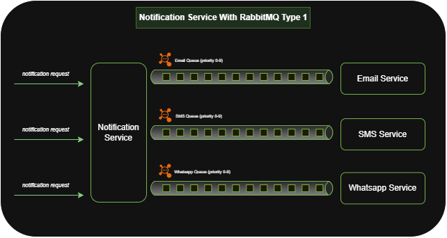

# Notification Service

## 📌 Project Description
This project demonstrates how to build a **scalable notification service** using **Spring Boot**, **Spring Cloud Stream**, and **RabbitMQ**.  

The service is designed to handle different workloads and scenarios by providing **three architecture patterns**. Each type is tailored for specific use cases such as **low volume**, **high throughput**, or **priority-based** messaging.  

---

## 🗂️ Index of Architectures
1. [Type-1: Central Exchange with Routing Keys](#type-1-central-exchange-with-routing-keys)  
2. [Type-2: Dedicated Queues per Producer](#type-2-dedicated-queues-per-producer)  
3. [Type-3: Priority Queues with Dead Letter Handling](#type-3-priority-queues-with-dead-letter-handling)  

---

## 🔹 Type-1: Channel per type with priority


In this setup:
- All messages are published to a **single central exchange** (`notification.exchange`).  
- Each message includes a **routingKey** header (`email`, `sms`, `whatsapp`).  
- RabbitMQ uses these routing keys to deliver messages into the correct queue.  
- Consumers are bound to specific queues and process messages independently.  

### ✅ Pros
- Simple to implement and maintain.  
- Easy to extend (just add a new queue + routing key for a new channel).  
- Centralized control → one exchange for all traffic.  
- Decouples producers from consumers (producers don’t need to know queue names).  

### ❌ Cons
- No native priority handling → high-priority messages may get stuck behind low-priority ones.  
- Single exchange could become a **bottleneck** under very high traffic.  
- Harder to apply **per-channel scaling rules** (all messages pass through the same exchange).  
  

---

## 🔹 Type-2: Dedicated Queues per Producer


In this setup:
- Each producer sends messages directly to its own **dedicated queue** (e.g., `notification.email.queue`, `notification.sms.queue`).  
- No central exchange is used; producers decide the target queue.  
- Consumers listen to their respective queues.  

✅ **Best for:** Workloads where **producers know the target channel** and traffic patterns are predictable.  
⚡ Eliminates one routing step but reduces flexibility.  

---

## 🔹 Type-3: Priority Queues with Dead Letter Handling


In this setup:
- Messages are sent to the central exchange with **priority** headers.  
- Each queue (`email`, `sms`, `whatsapp`) is configured with:  
  - `x-max-priority` → ensures urgent messages are processed first.  
  - `x-message-ttl` → controls message lifetime.  
  - `DLQ (Dead Letter Queue)` → failed messages are rerouted for later inspection.  
- Consumers use **retry policies with exponential backoff**.  

✅ **Best for:** **High throughput** and **mission-critical** notifications where priority and reliability matter.  

---

## 🚀 Example Request
```json
POST /notifications/notify
{
  "recipient": "john@example.com",
  "subject": "System Alert",
  "message": "Your account needs verification",
  "channel": "email",
  "priority": 9
}
