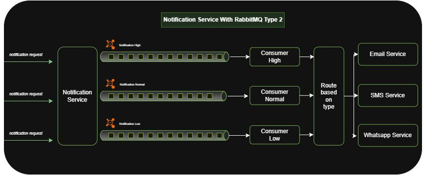

# Notification Service

## 📌 Project Description
This project demonstrates how to build a **scalable notification service** using **Spring Boot**, **Spring Cloud Stream**, and **RabbitMQ**.  

The service is designed to handle different workloads and scenarios by providing **three architecture patterns**. Each type is tailored for specific use cases such as **low volume**, **high throughput**, or **priority-based** messaging.  

---

## 🗂️ Index of Architectures
1. [Type-1: Channel per type with priority](#type-1-channel-per-type-with-priority)  
2. [Type-2: Three Priority Channels (High, Normal, Low)](#type-2-three-priority-channels-high-normal-low)  
3. [Type-3: Separate queues per type + per priority](#type-3-separate-queues-per-type--per-priority)  

---

## 🔹 Type-1: Channel per type with priority

In this setup:
- All messages are published to a **single central exchange** (`notification.exchange`).  
- Each message includes a **routingKey** header (`email`, `sms`, `whatsapp`).  
- RabbitMQ uses these routing keys to deliver messages into the correct queue.  
- Consumers are bound to specific queues and process messages independently.  

## ✨ Features  
- Supports different types of notifications (**Email, SMS, WhatsApp**)  
- Configurable **retry policies** for each consumer  
- **Dead Letter Queues (DLQ)** for failed messages  
- **Priority queues** to process urgent messages first 

## ✅ Pros
- Simple to implement and maintain.  
- Easy to extend (just add a new queue + routing key for a new channel).  
- Centralized control → one exchange for all traffic.  
- Decouples producers from consumers (producers don’t need to know queue names).  

## ❌ Cons
- Low-priority messages will still be delivered, but they can experience significant delays if high-priority traffic continues to dominate the queue. 
- Single exchange could become a **bottleneck** under very high traffic.  
- Harder to apply **per-channel scaling rules** (all messages pass through the same exchange).  
  

---
## 🏗️ Type-2: Three Priority Channels (High, Normal, Low)

In this design, we maintain **three separate queues and consumers**:

- `notification.high` → handled by `highConsumer` (higher concurrency).
- `notification.normal` → handled by `normalConsumer`.
- `notification.low` → handled by `lowConsumer` (lower concurrency).

Each consumer can process **multiple notification types** (Email, SMS, WhatsApp), but the channel determines **priority**.

---

## ✨ Features
- Supports **different notification types**: Email, SMS, WhatsApp.
- **Priority-based processing** (High, Normal, Low).
- **Custom concurrency & prefetch** tuning per channel.
- **Dead Letter Queues (DLQ)** for failed messages.
- **Retry mechanism** with requeue/reprocess strategy.
- **Scalable design** → each channel can be scaled independently.

## ✅ Pros
- **Strict priority isolation** → high-priority messages are never blocked by low-priority traffic.
- **Custom concurrency per channel** → e.g., 5 workers for high, 3 for normal, 1 for low.
- **Independent scaling** → scale consumers per channel depending on workload.
- **Per-priority DLQ handling** → easier debugging and retries.
- **Traffic resilience** → a spike in low-priority traffic won’t impact high-priority processing.
- **At-least-once delivery** → thanks to consumer groups and RabbitMQ’s reliability.

---

## ❌ Cons
- **Infrastructure overhead** → more queues, DLQs, and bindings to manage.
- **Producer responsibility** → the sender must correctly choose the priority channel.
- **Possible resource waste** → high-priority workers may sit idle while low-priority lags.
- **No dynamic reprioritization** → once in `low`, a message can’t jump to `high` without re-publishing.
- **Complex retry logic** → each priority has its own DLQ; retries need coordination.
- **Risk of starvation** → low-priority traffic may be heavily delayed if high-priority is constant.

---

## 🔹 Type-3: Separate queues per type + per priority

## Type 3 Design (9 Queues)

- **EmailHigh, EmailNormal, EmailLow**  
- **SMSHigh, SMSNormal, SMSLow**  
- **WhatsAppHigh, WhatsAppNormal, WhatsAppLow**

---
**Flow:**  
1. The producer sends a `NotificationRequest` with `type` (email, sms, whatsapp) and `priority` (high, normal, low).  
2. The controller routes the message to the correct queue dynamically.  
3. Each queue has its own consumer with configurable concurrency, retries, and DLQ.  
4. Consumers process messages independently and can be assigned to different service providers per use case.  
  
---

## Features

- Handles **3 types of notifications**: Email, SMS, WhatsApp.  
- **3 priority levels** per type: High, Normal, Low.  
- **Independent scaling** per queue using concurrency and prefetch settings.  
- **Retry and DLQ** per queue for robust error handling.  
- **Priority isolation**: high-priority messages are not blocked by lower-priority messages.  
- **Supports multiple service providers** per type based on use case (e.g., transactional vs marketing).  
- Fully **decoupled producer-consumer** model.  

---

## ✅ Pros

- **Full priority separation**: High-priority messages are never blocked by lower-priority ones.  
- **Independent scaling per queue**: Concurrency and prefetch can be tuned for each type and priority.  
- **Per-queue retry and DLQ**: Failures are isolated and easier to monitor.  
- **Predictable performance**: Guaranteed processing speed for high-priority queues.  
- **Fine-grained control**: Configure retries, TTLs, concurrency, and prefetch per queue.  
- **Supports multiple service providers**: Each queue can be handled by a different provider depending on use case.  
- **Separation of concerns**: Each consumer handles a specific type + priority, simplifying monitoring and maintenance.  

---

## ❌ Cons

- **Infrastructure overhead**: 9 queues + 9 DLQs + multiple consumers increase complexity.  
- **Producer responsibility**: Must correctly select the type and priority queue.  
- **Resource imbalance**: High-priority workers may be idle while low-priority queues are full.  
- **Limited dynamic reprioritization**: Low-priority messages cannot automatically jump to high-priority queues.  
- **Scaling complexity**: Adding a new type or priority requires creating new queues and consumers.  
- **Monitoring complexity**: More queues mean more metrics and DLQs to track.  

---
## Notes

- This project focuses on **architecture design and queue optimization** rather than complete implementation.  
- Message types, priorities, concurrency, retries, and DLQs can be adjusted for **real-world use cases**.  

